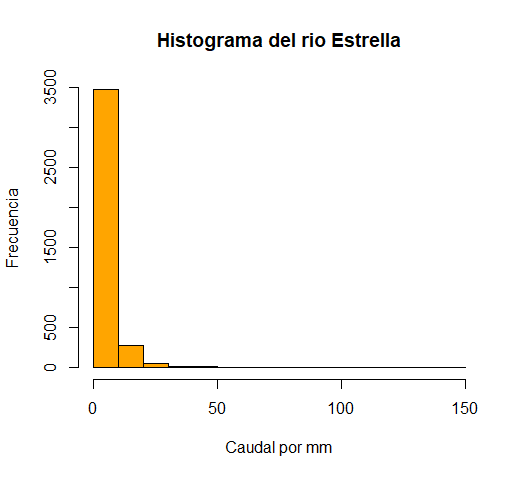

# Datos Hidrológicos

## Ejercicio exploratorio

Para la elaboración de la práctica exploratoria, se utilizó un archivo FDC.csv el cual contenía datos hidrológicos de las cuencas del río Estrella y río Banano. Se genera un directorio, en el cual quedaran guardados todos los pasos a realizar.

Figura 1. Directorio creado en la computadora.

Seguidamente, se importan los datos al programa R, es importante escribir el nombre exacto del archivo. Por lo que se utiliza la siguiente sintaxis: inp <- read.csv("FDC.csv", na.strings ="")

Para trabajar series de tiempo, es importante reconocer diferentes funciones (na.fail, na.omit, na.exclude, na.pass) ya que,a veces se trabaja con casos de datos faltantes y en caso de la climatología o hidrología, si esto sucede no se podría caracterizar la climatología o la hidrología. Se utiliza la siguiente sintaxis para generar un gráfico de series de tiempo: plot(inp[,2], main="Volumen de agua por tiempo encontrado en los rios", xlab="Fecha", ylab="Caudal por dia en mm", type = "l", col="green")
lines(inp[,3], col="black")

Figura 2. Las dos series de tiempo de los caudales.

Se pueden realizar histogramas para observar como se distribuyen las estadísticas descriptivas. El histograma hace un conteo de clases. Por ejemplo en el sigiente histograma del río Estrella, en la primera clase que es de 0 a 15mm de agua por día, se encuentra la gran mayoría de los caudales. Para realizarlo se utilizó la sintaxis: hist(inp[,2], main="Histograma del rio Estrella", xlab="Caudal por mm", ylab="Frecuencia", col="orange")

Figura 3. Histograma del río Estrella

