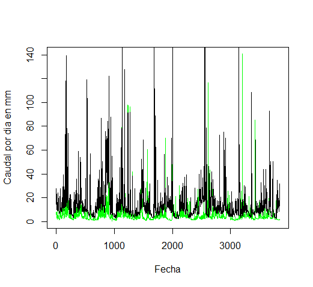

# Datos Hidrológicos

## Ejercicio exploratorio

Para la elaboración de la práctica exploratoria, se utilizó un archivo FDC.csv el cual contenía datos hidrológicos de las cuencas del río Estrella y río Banano. Se genera un directorio, en el cual quedaran guardados todos los pasos a realizar.

Figura 1. Directorio creado en la computadora.

