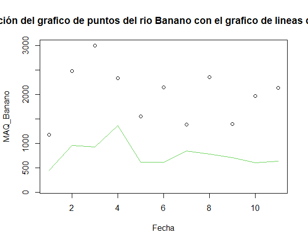

# Datos Hidrológicos

## Ejercicio exploratorio

Para la elaboración de la práctica exploratoria, se utilizó un archivo FDC.csv el cual contenía datos hidrológicos de las cuencas del río Estrella y río Banano. Se genera un directorio, en el cual quedaran guardados todos los pasos a realizar.

Figura 1. Directorio creado en la computadora.

Seguidamente, se importan los datos al programa R, es importante escribir el nombre exacto del archivo. Por lo que se utiliza la siguiente sintaxis: inp <- read.csv("FDC.csv", na.strings ="")

Para trabajar series de tiempo, es importante reconocer diferentes funciones (na.fail, na.omit, na.exclude, na.pass) ya que,a veces se trabaja con casos de datos faltantes y en caso de la climatología o hidrología, si esto sucede no se podría caracterizar la climatología o la hidrología. Se utiliza la siguiente sintaxis para generar un gráfico de series de tiempo: plot(inp[,2], main="Volumen de agua por tiempo encontrado en los rios", xlab="Fecha", ylab="Caudal por dia en mm", type = "l", col="green")
lines(inp[,3], col="black")

Figura 2. Las dos series de tiempo de los caudales.

Se pueden realizar histogramas para observar como se distribuyen las estadísticas descriptivas. El histograma hace un conteo de clases. Por ejemplo en el sigiente histograma del río Estrella, en la primera clase que es de 0 a 15mm de agua por día, se encuentra la gran mayoría de los caudales. Para realizarlo se utilizó la sintaxis: hist(inp[,2], main="Histograma del rio Estrella", xlab="Caudal por mm", ylab="Frecuencia", col="orange")

Figura 3. Histograma del río Estrella

Debido a que en ocasiones es inusual trabajar con las columnas indicando la función input, también se puede utilizar la opción names, con esta función se pueden asignar nombres, de esta forma se podría trabajar directamente de la columna, por lo que la hace fácil de usar. Al emplear la opción plot y ejecutarla con las funciones names y attach, se genera un gráfico de puntos. Para esto se usa la siguiente sintaxis: 
names(inp) <- c("fecha", "Estrella","Banano") /
attach(inp) /
plot(Estrella, main="Caudal diario del rio Estrella en mm", xlab="Fecha", ylab="Caudal del rio Estrella", col="blue") 

Figura 4. Gráfico de puntos del caudal diario del río Estrella.

Para agregar la serie de tiempo y el dato de caudal a valores anuales y mensuales, se deben definir el formato de la fecha del tiempo de la serie, para esto se debe crear un archivo intermedio y definir la función, se usan las sintaxis: Tempdate <- strptime(inp[,1], format = "%d/%m/%Y") /
MAQ_Estrella <- tapply(Estrella, format(Tempdate, format="%Y"), FUN=sum) /
MAQ_Banano <- tapply(Banano, format(Tempdate, format="%Y"), FUN=sum) /
write.csv(rbind(MAQ_Estrella,MAQ_Banano), file="MAQ.csv")
Para visualizar en un gráfico los valores anuales del caudal, se ejecuta la sintaxis: plot(MAQ_Banano, ylim=c(100,3000), main="Comparación del grafico de puntos del rio Banano con el grafico de lineas del rio estrella", xlab="Fecha") junto con la sintaxis: lines(MAQ_Estrella, col=3)

Figura 5. Valores anuales de los caudales Banano y Estrella

Para el análisis de correlación se define la función cor. Se va a correlacionar el río Banano junto con el río la Estrella, con el fin de saber si esas cuencas, poseen una relación hidroclimáticamente cuantificable. En esta función se pueden utilizar varios métodos para la correlación como pearson, kendall y spearman, cada una poseen sus posiciones. Se utiliza la siguiente sintaxis: corinp <- cor(inp[,2:3], method= "spearman") y para graficar se aplica la sintaxis: plot(Estrella, Banano, main="Correlación de ambos ríos (Banano y Estrella)", xlab="Rio Estrella", ylab="Rio Banano", col="red")

Figura 6. Correlación entre ambos ríos.
